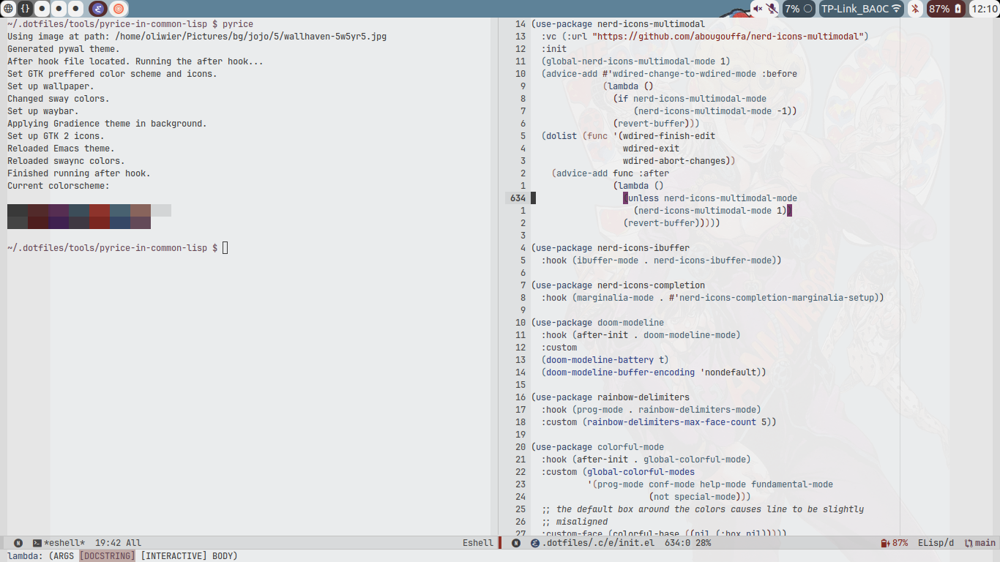
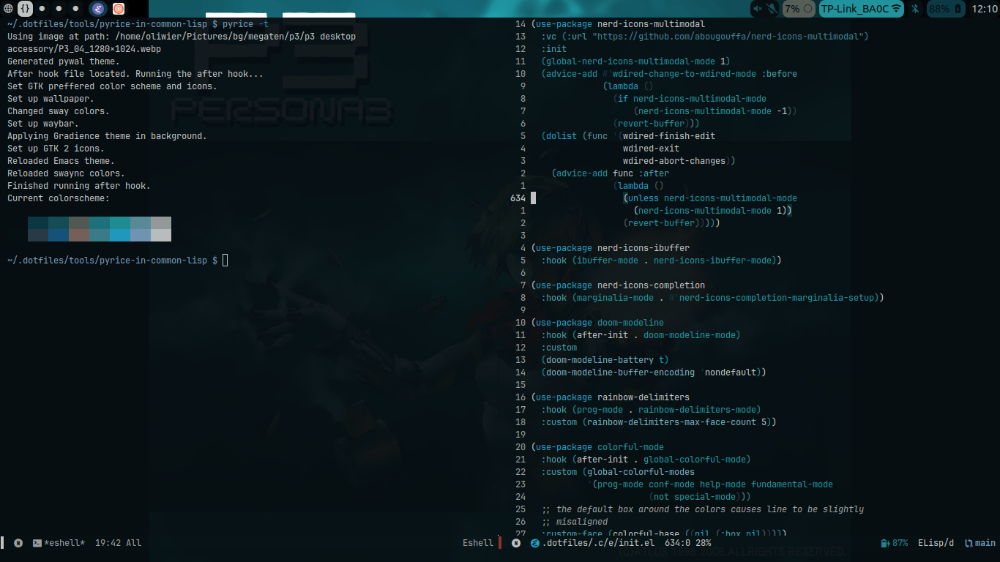

[[https://melpa.org/#/modus-ewal-theme][file:https://melpa.org/packages/modus-ewal-theme-badge.svg]]
* Description
A theme that retrieves pywal colors and generates a theme using =modus-themes= theme generation functions.
* Screenshots

* Installation
The package is available on [[https://melpa.org/#/modus-ewal-theme][MELPA]], so you can install it with =package-install=, =use-package= or other package manager.
* Usage
=load-theme= should work.

If you don't have the pywal cache file or it's not made right, the theme will not load, and you will be messaged about it.
In such case, you may need to load the package again.

If your pywal colors have changed, you can invoke =modus-ewal-theme-regenerate-theme=.
By default, it will also invoke =load-theme= which you can disable with =modus-ewal-theme-load-after-regeneration-p= variable.
* Tips
=modus-ewal-theme-custom-faces= can be used to customize certain faces.
The changes will be visible after running =modus-ewal-theme-regenerate-theme=.
* Credits
- The maintainers of [[https://github.com/cyruseuros/ewal][ewal]]
- Protesilaos Stavrou for adding theme generating functionality to [[https://protesilaos.com/emacs/modus-themes][Modus Themes]]
